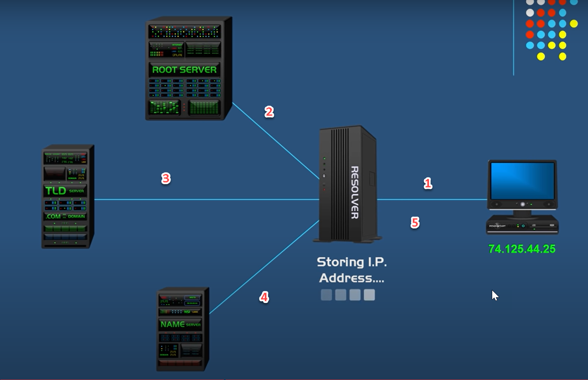
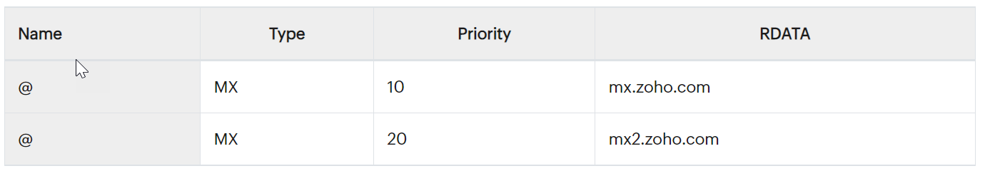
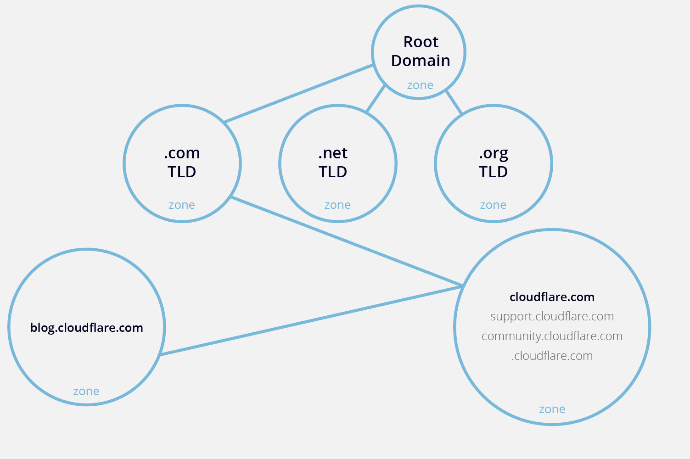

# What is DNS?
The Domain Name System (DNS) is the phonebook of the Internet. Humans access information online through domain names, like nytimes.com or espn.com. Web browsers interact through Internet Protocol (IP) addresses. DNS translates domain names to IP addresses so browsers can load Internet resources.

Each device connected to the Internet has a unique IP address which other machines use to find the device. DNS servers eliminate the need for humans to memorize IP addresses such as 192.168.1.1 (in IPv4), or more complex newer alphanumeric IP addresses such as 2400:cb00:2048:1::c629:d7a2 (in IPv6).

# How does DNS work?
## There are 4 DNS servers involved in loading a webpage:
1. DNS recursor - The recursor can be thought of as a librarian who is asked to go find a particular book somewhere in a library. The DNS recursor is a server designed to receive queries from client machines through applications such as web browsers. Typically the recursor is then responsible for making additional requests in order to satisfy the client’s DNS query.

2. Root nameserver - The root server is the first step in translating (resolving) human readable host names into IP addresses. It can be thought of like an index in a library that points to different racks of books - typically it serves as a reference to other more specific locations.

3. TLD nameserver - The top level domain server (TLD) can be thought of as a specific rack of books in a library. This nameserver is the next step in the search for a specific IP address, and it hosts the last portion of a hostname (In example.com, the TLD server is “com”).

4. Authoritative nameserver - This final nameserver can be thought of as a dictionary on a rack of books, in which a specific name can be translated into its definition. The authoritative nameserver is the last stop in the nameserver query. If the authoritative name server has access to the requested record, it will return the IP address for the requested hostname back to the DNS Recursor (the librarian) that made the initial request.

So, when you type in www.yahoo.conm in your browser, if your browser or operating system can't find the IP address in its own cache memory, it will send the query to next level what is called resolver server, the resolver server is basically called ISP (Internet Server Provider), so when the resolver server receives the query, it will check its cache memory to find the IP address, if cannot find, it will send the query to Root Server, Root server is the top of the DNS hierachy (operated by 12 orgnizations), -> TLDtop level domain server store the address information for the top level, such as .com .cn, .org, etc, so TLD server not gonna know what your yahoo.com ip is, TLD will direct the request to next level - Authoritative nameserver, which should know the ip address of given domain addresss, and it will give the ip address to DNS resolve server, which will be cached there, in case of next query

# What are DNS record types?

DNS servers create a DNS record to provide important information about a domain or hostname, particularly its current IP address. The most common DNS record types are:

1. Address Mapping record (A Record)—also known as a DNS host record, stores a hostname and its corresponding IPv4 address.
2. IP Version 6 Address record (AAAA Record)—stores a hostname and its corresponding IPv6 address.
3. Canonical Name record (CNAME Record)—can be used to alias a hostname to another hostname. When a DNS client requests a record that contains a CNAME, which points to another hostname, the DNS resolution process is repeated with the new hostname.
4. Nameserver (NS) record
5. Mail exchange (MX) record

## A record
The A record is the most important DNS record type. The "A" in A record stands for "address." An A record shows the IP address for a specific hostname or domain. For example, a DNS record lookup for the domain example.com returns the following result:

From figure 1 above, we can see that the current IP address is 93.184.216.34. The A record only supports IPV4 addresses. Later in this post, we'll see how to point a domain to an IPV6 address using another DNS record type.

Use of a record
* The main use of A record is for IP address lookup. Using an A record, a web browser is able to load a website using the domain name. As a result, we can access websites on the internet without knowing their IP addresses.

* Another use of A record is in the domain name system-based blackhole list (DNSBL). Here, the A record is used to block mail from known spam sources.

## AAAA record
AAAA record, just like A record, point to the IP address for a domain. However, this DNS record type is different in the sense that it points to IPV6 addresses.

IPV6 is an upgrade over IPV4 as it offers more IP addresses. As a result, IPV6 solves the issue of running out of unique IP addresses. An IPV6 address looks something like the following:
Use of AAAA record
Usage of the AAAA record for DNS resolution has great potential because it uses IPV6, which is an improvement over IPV4. Also, as the internet keeps growing and we're running out of IPV4 addresses, the potential for AAAA records is high.

AAAA records are used to resolve a domain name to the newer IPV6 protocol address.

### CNAME record
CNAME—or, in full, "canonical name"—is a DNS record that points a domain name (an alias) to another domain. In a CNAME record, the alias doesn't point to an IP address. And the domain name that the alias points to is the canonical name. For example, the subdomain ng.example.com can point to example.com using CNAME. Here example.com points to the actual IP address using an A record.

Use of CNAME record
A practical example for the use of CNAME records is running multiple subdomains for different purposes on the same server. For example, we can use ftp.example.com for file transfer protocol (FTP) and serve webpages via www.example.com. We can then use a CNAME record to point both subdomains to example.com. The main domain example.com then points to the server's IP address using an A record.

It's also possible to point a CNAME to another CNAME. However, doing so is inefficient and can lead to slow load speed and poor user experience.

### NS record
A nameserver (NS) record specifies the authoritative DNS server for a domain. In other words, the NS record helps point to where internet applications like a web browser can find the IP address for a domain name. Usually, multiple nameservers are specified for a domain. For example, these could look like ns1.examplehostingprovider.com and ns2.examplehostingprovider.com.

Use of NS record
If you've purchased a web hosting service or set up a simple website, you probably received an email with nameserver details. Those nameservers, in simple terms, connect your domain name to the actual server your site is hosted on. The nameserver contains other DNS records for the domain like an A record and MX record.

###  MX record
A mail exchange (MX) record, is a DNS record type that shows where emails for a domain should be routed to. In other words, an MX record makes it possible to direct emails to a mail server.

You can have multiple MX records for a single domain name. And what this means is that you can have backup email servers. The following shows an example of a domain with multiple MX records:

From the above table, the MX record with priority 10 will be the primary mail server, while the secondary server will only be used when the primary server is unavailable (or fails to send emails). The lower the priority value, the higher the actual priority.

Use of MX record
With an MX record, it's possible to hand off emails to a dedicated email server. For example, you can decide to leave all the trouble of setting up webmail on a server you own to a specialized email provider. This comes with many benefits, including custom email clients for reading and sending emails, and improved security and spam filters. Also, you can use a service like Site24x7 to monitor and verify issues with the mail server your MX records point to.

### Other DNS record types
In addition to the five DNS record types covered so far, here are some other record types:

* SOA record: SOA stands for "start of authority." It's an important DNS record type that stores admin information about a domain. This information includes the email address of the admin and when the domain was last updated.
* TXT record: TXT stands for "text," and this record type lets the owner of a domain store text values in the DNS. Several services use this record to verify ownership of a domain.
* PTR record: A pointer (PTR) record provides a domain name for reverse lookup. It's the opposite of an A record as it provides the domain name linked to an IP address instead of the IP address for a domain.
* SRV record: Using this DNS record type, it's possible to store the IP address and port for specific services.
* CERT record: This record type stores public keys certificates.
DCHID: This DNS record type stores information related to dynamic host configuration protocol (DHCP).
DNAME: The full meaning of DNAME is "delegation name." This record type works very similarly to CNAME; however, it points all the subdomains for the alias to the canonical domain name. That is, pointing the DNAME for secondsite.com to example.com will also apply to staff.secondsite.com and any other subdomain.

# DNS Zone and DNS Zone file
The DNS is broken up into many different zones. These zones differentiate between distinctly managed areas in the DNS namespace. A DNS zone is a portion of the DNS namespace that is managed by a specific organization or administrator. A DNS zone is an administrative space which allows for more granular control of DNS components, such as authoritative nameservers. The domain name space is a hierarchical tree, with the DNS root domain at the top. A DNS zone starts at a domain within the tree and can also extend down into subdomains so that multiple subdomains can be managed by one entity.

A common mistake is to associate a DNS zone with a domain name or a single DNS server. In fact, a DNS zone can contain multiple subdomains and multiple zones can exist on the same server. DNS zones are not necessarily physically separated from one another, zones are strictly used for delegating control.

For example, imagine a hypothetical zone for the cloudflare.com domain and three of its subdomains: support.cloudflare.com, community.cloudflare.com, and blog.cloudflare.com. Suppose the blog is a robust, independent site that needs separate administration, but the support and community pages are more closely associated with cloudflare.com and can be managed in the same zone as the primary domain. In this case, cloudflare.com as well as the support and community sites would all be in one zone, while blog.cloudflare.com would exist in its own zone.

DNS Zone
All of the information for a zone is stored in what’s called a DNS zone file, which is the key to understanding how a DNS zone operates.

## What is a DNS zone file?
A zone file is a plain text file stored in a DNS server that contains an actual representation of the zone and contains all the records for every domain within the zone. Zone files must always start with a Start of Authority (SOA) record, which contains important information including contact information for the zone administrator.